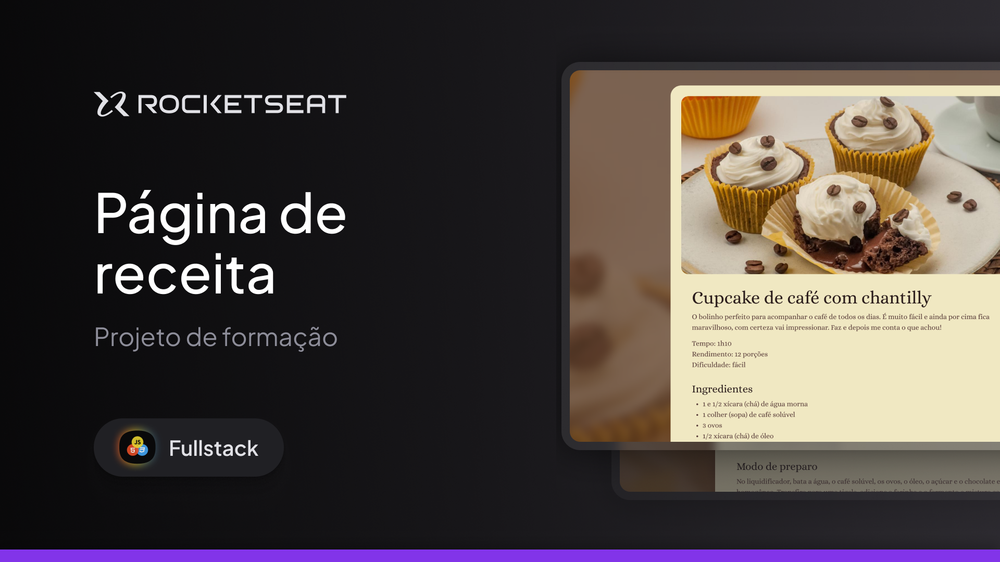

<h1 align="center"> Página de Receita </h1>

  <a href="#-projeto">Projeto</a>&nbsp;&nbsp;&nbsp;|&nbsp;&nbsp;&nbsp;
  <a href="#-tecnologias">Tecnologias</a>&nbsp;&nbsp;&nbsp;|&nbsp;&nbsp;&nbsp;
  <a href="#memo-licença">Licença</a>

  

 

  

## 💻 Projeto

O Primeiro projeto da formação fullstack da rocketseat ensinou a fazer uma página de receitas simples e bonita, adicionei um pouco de responsividade e conhecimentos aprendidos em outro curso para deixar do meu jeito e visando não copiar códigos.

- [Acesse o projeto finalizado, online](https://viniciogomesr.github.io/projeto-receita/)

## 🚀 Tecnologias

Esse projeto foi desenvolvido com as seguintes tecnologias:

- HTML e CSS
- Git e Github

## :memo: Licença

Esse projeto está sob a licença MIT.

---